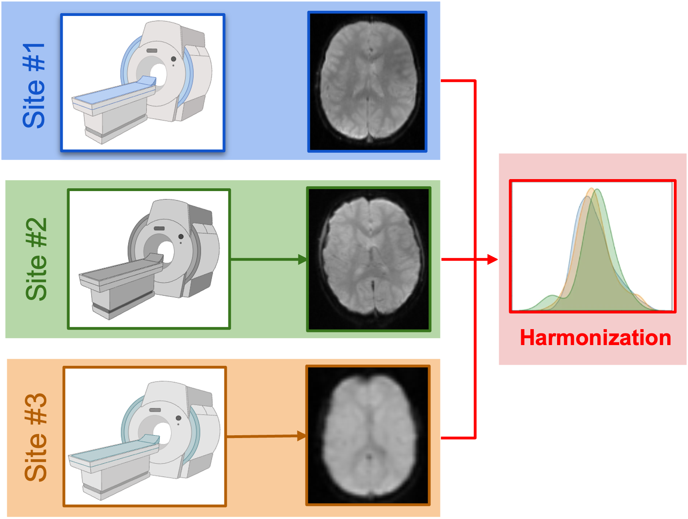

# Does Nonverbal IQ Modulate the Relation Between Phonological Awareness and Reading Skill? Harmonization of Multi-Site fMRI-data

## Leaders

Isaac Chen from the [Brain Development Lab](https://lab.vanderbilt.edu/boothlab/)

## Collaborators

James R. Booth (james.booth@vanderbilt.edu)

## Project Description

Research shows that reading skill (i.e. accuracy of reading words aloud) and phonological awareness (i.e. sensitivity to the sound structure of language) are bi-directionally related, but we do not know how non-verbal IQ (i.e. sensitivity to stimulus patterns) influences this relationship. The proposed project seeks to examine how nonverbal IQ modulates the effect of (1) behavioral differences in phonological awareness on the neural basis of reading skill and (2) behavioral differences in reading skill on the neural basis of phonological awareness.

Neuroimaging data for this project were collected across various sites using different scanners. Pooling fMRI data across multiple sites is critical for improving the generalizability of findings to a diverse population. However, multi-site fMRI data are often affected by non-biological variability, attributable to differences in scanner manufacturers, non-standardized imaging acquisition parameters, or other intrinsic factors. This source of variability may lead to limited statistical power or even result in spurious findings. The objective for Brainhack Vanderbilt 2025 is to develop a harmonization pipeline designed to reliably remove between-scanner variability and ensure reproducibility for downstream analyses.



## Learn About the Three Datasets

Read through each data descriptor article and browse the OpenNeuro datasets.

- Article: [Suárez-Pellicioni et al. 2019](/data_descriptor/PellicioniLytle.SD.2019.pdf) <br>
   Data: [ds001486 - Brain Correlates of Math Development](https://openneuro.org/datasets/ds001486/versions/1.3.1)

-  Article: [Lytle et al. 2019](/data_descriptor/LytleMcNorgan.SD.2019.pdf) <br>
   Data: [ds001894 - Longitudinal Brain Correlates of Multisensory Lexical Processing in Children](https://openneuro.org/datasets/ds001894/versions/1.4.2)

- Article: [Lytle et al. 2020](/data_descriptor/LytleBitan.DB.2020.pdf) <br>
   Data: [ds00236 - Cross-Sectional Multidomain Lexical Processing](https://openneuro.org/datasets/ds002236/versions/1.1.1)

## How to Get Started with ComBat

1. Read the documentation for [neuroCombat](https://github.com/Jfortin1/ComBatHarmonization) by [Fortin et al. 2018](https://pmc.ncbi.nlm.nih.gov/articles/PMC5845848/).

2. From [Dr. John Muschelli's Neuroimaging Analysis with R series](https://johnmuschelli.com/imaging_in_r/#21_Schedule), read through the slides and try running the example code for the lecture **Image Harmonization**.

## Installation

1. **Library Dependencies**:
   Install the required R packages:

   ```r
   # Install required packages
   # SummarizedExperiment is required to download neuroCombat
   if (!require("BiocManager", quietly = TRUE))
       install.packages("BiocManager")

   BiocManager::install("SummarizedExperiment")

   # Download neuroCombat from github
   library(devtools)
   install_github("jfortin1/neuroCombatData")
   install_github("jfortin1/neuroCombat_Rpackage")
   ```
2. **Clone Repository**:
Clone the repository to your local machine:

   ```bash
   git clone <https://github.com/hsuanwei-chen/task-VisRhyme_harmonization.git>
   ```

## How to Use this Repository

TBD
